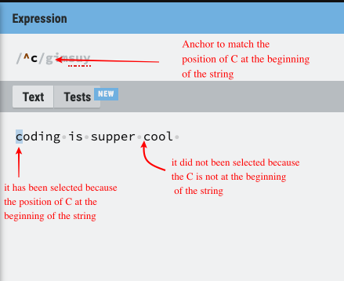
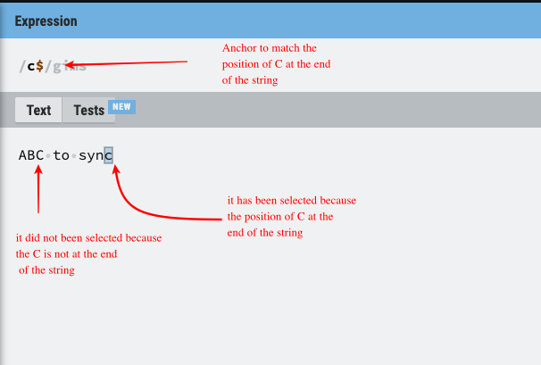
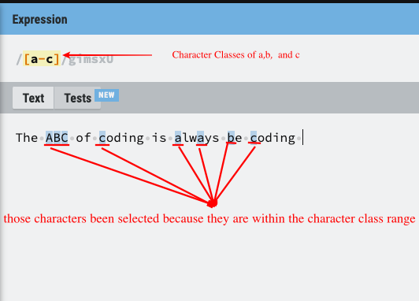
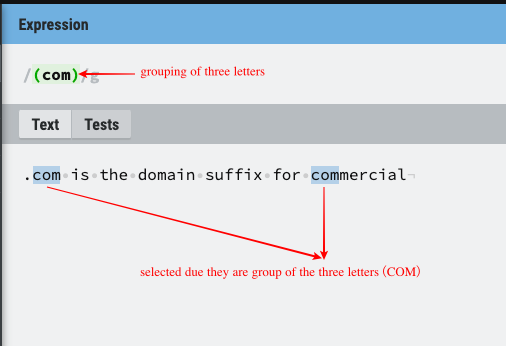
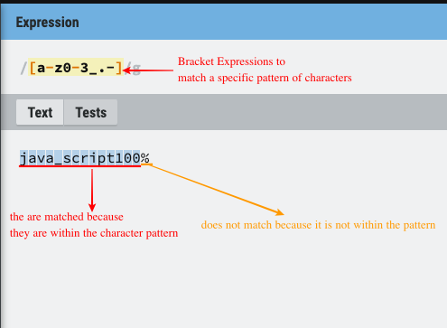
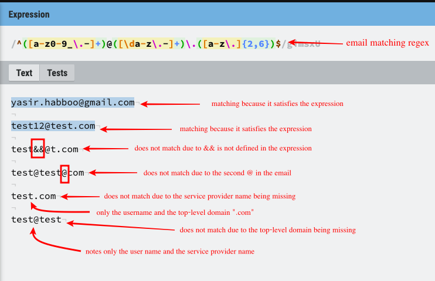

# Email matching Regex

file intended to explain the details of how to match an email using regular expression(regex). The description below will detail each component of the regular expression and how it works.

## Summary

During writing a code, developers often face a problem that is how to ensure that the user can enter the right format for an email address?
One of the solutions is using regex expression to match an email format.

Matching Email fromat regex are:
/^([a-z0-9_\.-]+)@([\da-z\.-]+)\.([a-z\.]{2,6})$/

The description below will provide details of the anchors, quantifiers,character-classes, grouping and capturing,greedy and lazy match and bracket expressions used in this regex.

## Table of Contents

- [Anchors](#anchors)
- [Quantifiers](#quantifiers)
- [Character Classes](#character-classes)
- [Escaped Characters](#Escaped-Characters)
- [Grouping and Capturing](#grouping-and-capturing)
- [Bracket Expressions](#bracket-expressions)
- [Greedy and Lazy Match](#greedy-and-lazy-match)

## Regex Components

### Anchors

Anchor:^
Code Snippet `/^`

Description:
Anchors have a special meaning in regex, however, they do not match any character. Instead, they match a `position` before or after characters.

Example: let asume that we are writing a test code to match string value that start  `C`
see the following code snipet :
` let str = 'Code';`
`console.log(/^C/.test(str));`
output: `true`
The query `/^C/` matches any string that starts with the letter `C` and returns `true`.
The anchor ^ indicates that the beginning of the string must match the query character.

Anchor: $
 Code Snipet `$/` 
 Description: Another type of anchor is $ which does the exact opposite of the previous anchor, instead of matching the begging of the string, it will match the end of the line. 
 Example: let asume that we are writing a test code to mach any string value that start with `C` see the following code snipet Example: 
 `let str = 'Word';`
 `console.log(/d$/.test(str));` 
 output:`true`

 The query `d$` matches any string that end with the letter `d` and returns `true`

 we will often need to use `^` and `$` to check if the string fully matches the required pattern.

 

 Example: To check the email format is correct

 `let email =/^([a-z0-9_\.-]+)@([\da-z\.-]+)\.([a-z\.]{2,6})$/.test(test22@test.com)`
 `console.log(email)`
 output: `true`

### Quantifiers

Quantifiers: +
Code Snipet `+`
Description: It is used to connect the groups together, for example, the email address component is `userName`, `@` to connect the userName with the mail server or the `domain`

Quantifiers: {2,6}
Code Snipet `{minRang,MaxRing}`
Description: It is used to match one or more of the preceding elements, which means it will match the 2-6 characters for the character set of `[a-z\.]
EXAMPLE" Let assume that we want to mach a string of maximum length is `6` character 
 `let str = 'code';`
 `console.log(/^([a-z\.]{2,6})$/.test(str));` 
 output:`true`

 the output will be `true` because the word `code` had 4 letters, however, if we pass the word `javascript` it will return `false` because the length of the word is `10` which exceeds the required length 

 

### Character Classes
Character Classes: a-z,0-9,.
Code Snipet `a-z0-9`
Description: A character class allow you to match any symbol from a certain character set. The hyphen is used inside the character set to define the range of characters, also we can use more than one range as the case in our code snippet. 

Example: let assume that we have a set of characters `A-C` and we gave a sentence to match our string character, the sentence `The ABC of coding is always be coding`

output: The `ABC` of `c`oding is `a`lways `b`e `c`oding 

Example 2: let asume that we want to match any word followed with numbers
`let str = 'ES6`
`let re =[/ES\d]`
`console.lof(str.match(re));`

output:`['ES6]`
the output will return an array that contains the regular characters and character classes `\d`, therefore it matches all the characters so even if we change the number in `str` to `5` it will return `5` do to the character class `\d`, or we can give it an array of number`[0-9]` will also work.

### Escaped Characters
Escaped Characters: \
Code Snipet: `\.`
Description: Escaped characters are used to insert reserved, special, and Unicode characters, all escaped characters begin with the \ character.

example: in our expression, we are trying to match `.` therefore we used with escaped characters. let take the following expression `([a-z0-9_\.-])` that will match any string, number, "_", "-", and with help of escaped characters it will match the`.`

### Grouping and Capturing
Grouping and Capturing:()
Code Snipet:`([a-z\.]{2,6})`
Description: capturing groups are a way to treat multiple characters as a single unit. the are created by placing the characters to be grouped inside (). using grouping and capturing is useful to extract a substring or using a backreference(identifies a previously matched group and looks for exactly the same text again). 

 example : let asume that we only want to capture a group of 3 chracter only 
 `let regex = ^([a-z\.]{2,3})$`
 `alert ('com'.match(regex));`
 output: `com`
The output will match because `com` full within the group of `([a-z])` and it matches the quantifiers`{2-3}` due to we have only 3 characters

### Bracket Expressions
Br:[]
code Snipet:`[a-z0-9_\.-]`
Description: Bracket expression is a regex that matches a specific pattern of characters (alphabetic, numeric, special characters, symbols, etc..) defined inside the bracket e.g`[abc]`, also we can define a range of characters inside brackets by using hyphen e.g`[a-z]`

Example:`[a-z0-9_\.-]` indicates that the string must include at least 1 character between `a` and `z` or between`0` and `9` or `_` or `.` or `-`

### Greedy and Lazy Match
Greedy and Lazy Match: + 
code Snippet: `+`
Description: Greedy means matching the longest possible string, while lazy will match the shortest possible string. 
Email match regex used greedy match since it includes the + Quantifier, it will match as many times as possible strings and giving back as needed, another greedy quantifier used in this regex is {} when we matching `{2,6}` the last capture group. 

### full regex expreestion
Email matching regix
code snipt:`/^([a-z0-9_\.-]+)@([\da-z\.-]+)\.([a-z\.]{2,6})$/`
Description: the expression start with anchor `/^` to indicate the starting of the string, followed by group capturing `()`, inside the group capturing parentheses there is a bracket expression to match our character pattern, inside the bracket expression we declared Character Classes that will be allowed to use in the email those classes are `a-z`, `0-9`, `_`, `.`,`-`, also we used regular characters to identify the `@` location, then we used a greedy match to get the longest possible string, also we used quantifiers expression to specify the minimum and maximum character accepted at the end of the expression`{2-6}`, finally we end the expression with `$` to end the string 

## Author

My name is Yasir Habboo. My goal is to learn web technology such as Javascript, Node.js, Sequelize, MySQL, MongoDB, CSS and HTML, and other web technologies and programming languages, my Git Hub page has many projects you can learn from, this gist is intended to show you the importance of Regex and how to work with it to help you in a design your solutions.

GitHub:https://github.com/Yasir19